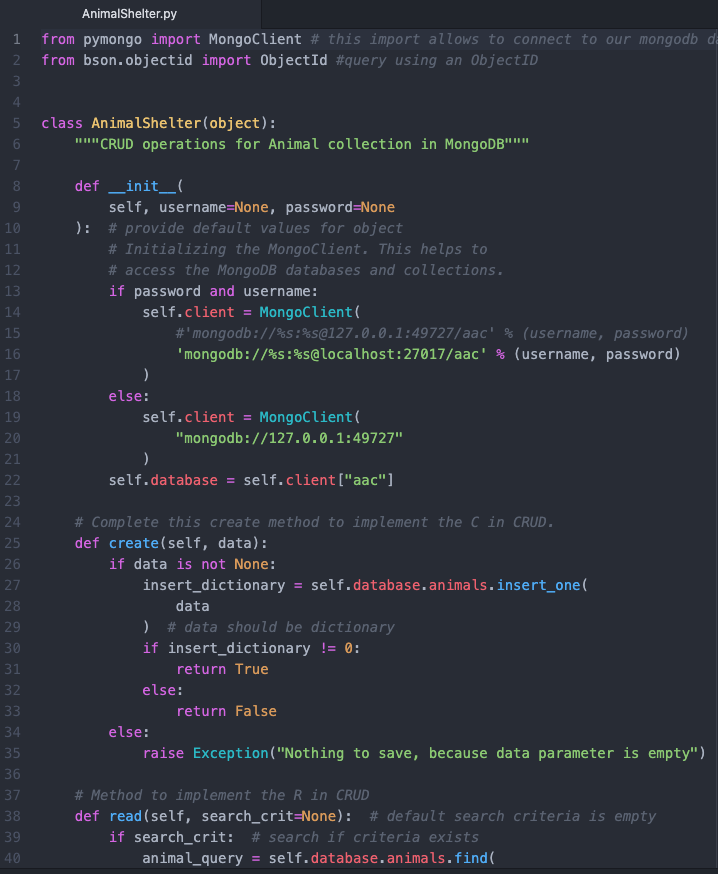
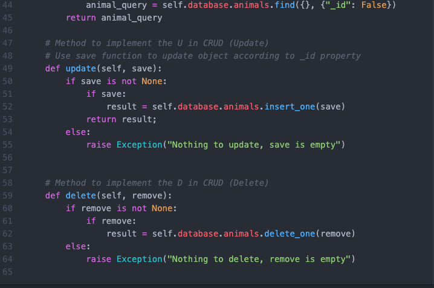
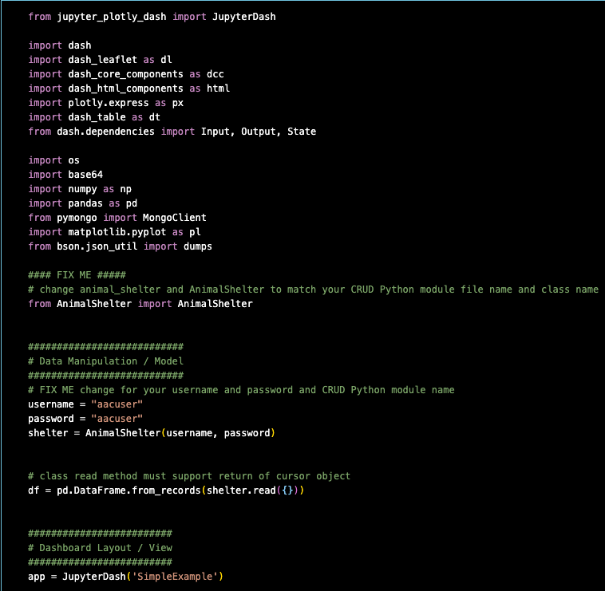
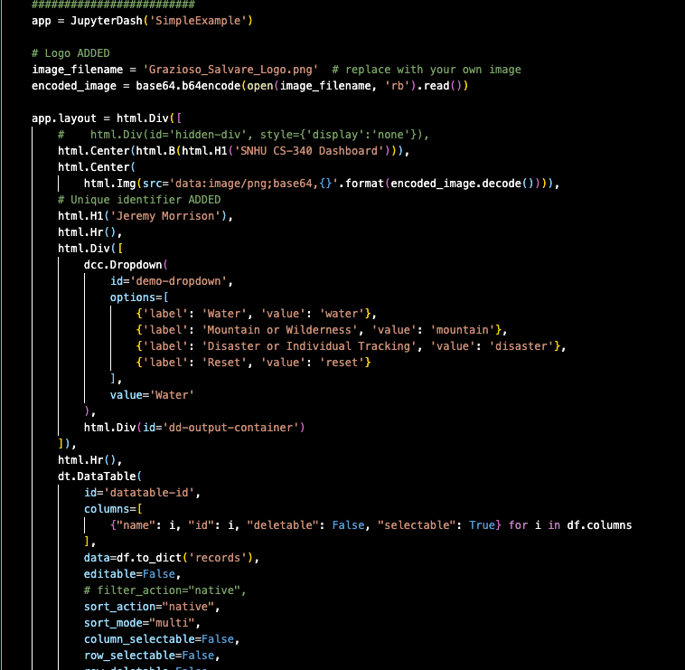
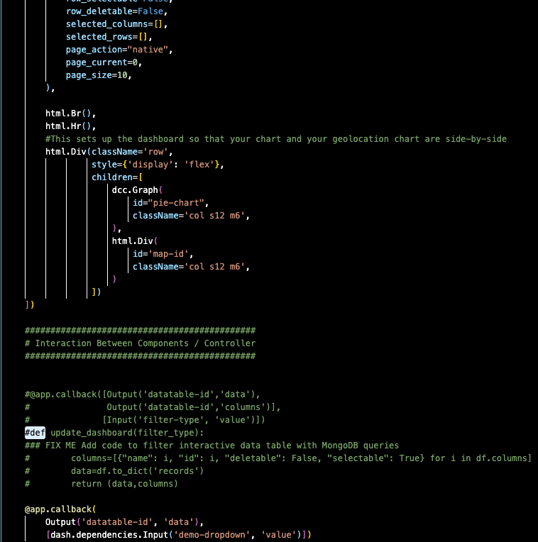
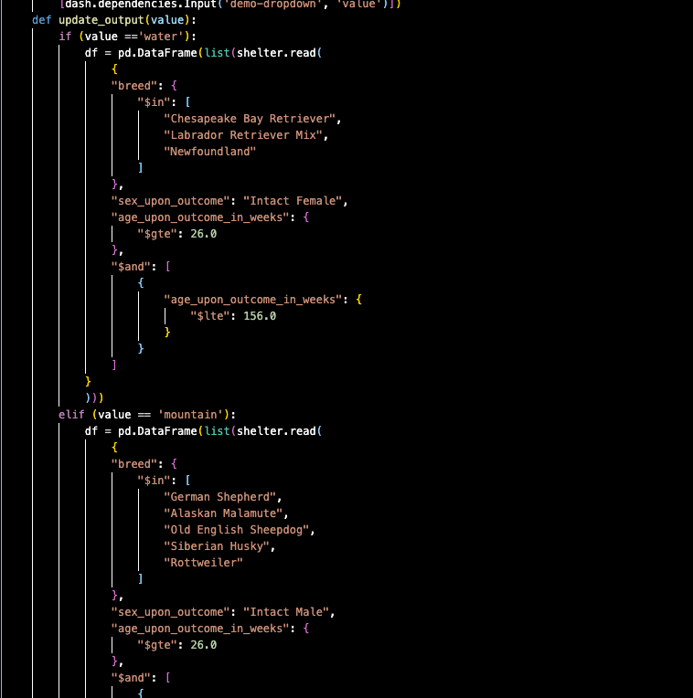
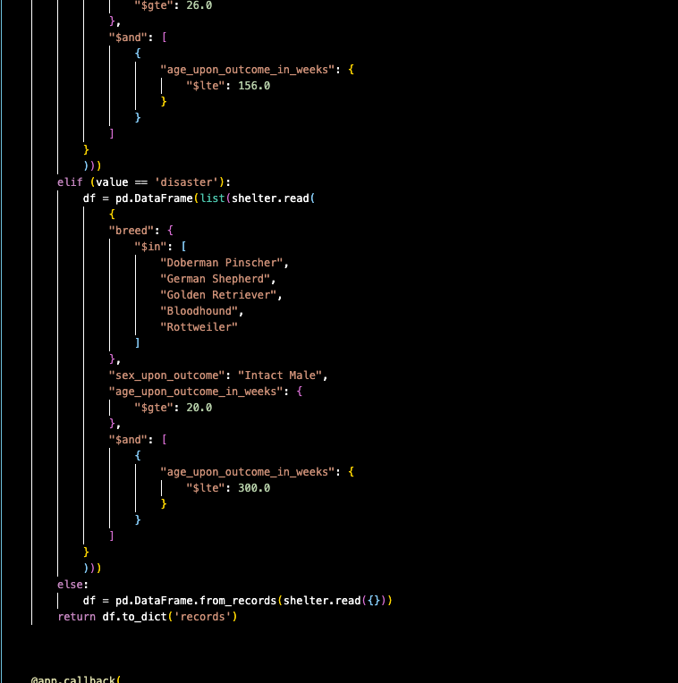
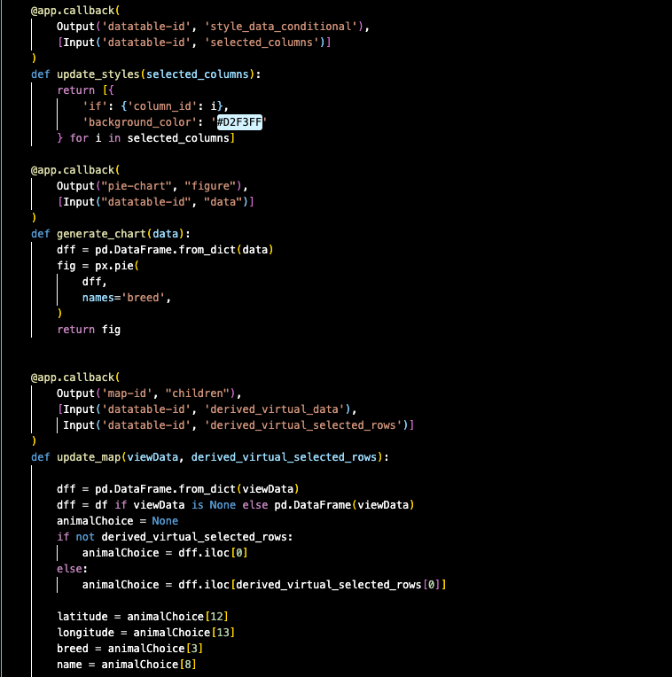
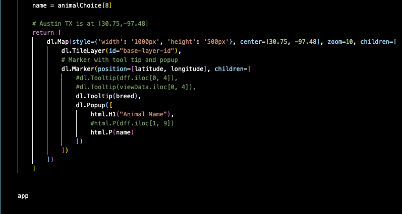

## Self Assessment

  Throughout my capstone course, completing the course work has helped me better understand completing projects within a given time frame and updating progress if the instructor were a client as we complete milestones and journal assignments. This process in a way simulates what would be required in a job setting, completing tasks and updating progress. I have a better understanding of what it takes to take a project and re-create that project in a new language I have no experience with and the struggle of cramming new information and programming and debugging to complete a project milestone within a given time period. The lessons and experienced gained are aligned with the skills necessary to becoming a developer whether it software or web or applications, these are skills one must have especially when things get complicated. It is mentally draining to run into issues that take a week of researching and staring at the same piece of code to find an issue and most would simply quit, I enjoy the challenge and the learning experience I gain from those challenges. This course has helped me become more aware of these challenges and more prepared to deal with challenges and set reasonable expectations of those challenges within reasonable time frames. Throughout the computer science program, we have participated in group discussion regarding projects and discussions with instructors on projects and things that may be holding up progress and everyone involved has been very helpful to one another and open to communicate resolutions with each other and this is like what a career environment should feel like, a team that communicates and collaborates well to reach goals and deadlines together. Communicating progress through journals in many courses is like communicating project progress to stakeholders only we are communicating that progress to an instructor through detailed analysis of what we have completed each week including images breaking down those details in a way anyone might understand what it is we are working toward. In the capstone course as well as many other courses in the computer science program we work with data structures and algorithms as these are the core of any software or web project. In this project specifically data was originally structured in json format and converted to a comma separated csv file and uploaded to a php database. It was originally a NoSQL database mongo dB, each has its pros and cons as json is very easy to work with and php provides a simple dashboard that allows easy database access and manipulation, both are similar in query syntax. Different functions, classes, and algorithms are used to sort and manipulate the data within those structures as in this project I used a random number function to generate user id’s for the users database when signing up, there are also various if else statements directing what happens when things are clicked or ran for instance when the index page is loaded an if else statement will check certain parameters and run a connection to the database and run a query on a specific table in the database and return filtered or organized data displayed to a user. All this project was originally in python through Jupyter notebook so in order to recreate this the way I did I had to completely re engineer the code through html, CSS, bootstrap, php, JavaScript, a mix of different tools to get the desired results and it turned out better than I had pictured it in my mind when I began the project. There are a couple small bugs that still need to be worked out such as the filter data page not loading the first entry in the database and the background of the table header not remaining solid white but other than those 2 small things the project was successful. This was also the first time I have created a login sign up for a web page and this was a very basic login, but I have done research on more advanced forms of security as well and may upgrade this project after the completion of the course. The computer science program has opened my skills to a variety of other areas as well, I have taken courses on collaboration, data structures and algorithms, data analysis, programming languages, as well as rendering 3 dimensional scenes using c++ and opengl libraries, I am also taking further courses on full stack development, databases, and reverse engineering after this course.


  In this project I began by reviewing the original project and running the project to get comfortable with the purpose and functionality. After reviewing I decided I would recreate a webpage that was more user friendly and allowed more functionality in accessing and manipulating the data from the database as well as create a login and register so that only registered users were able to access the webpage to manipulate the database. After downloading the necessary software such as xampp and atom I ran xampp and configured it to run as my local server and ran a test database and query through a small project to make sure everything was operational. I began with the config file that establishes a connection to the database which is simply defining variables for the server login and database access then create a variable that connects to the database or throws an error if there is an error. Then I began the login page by including the connections page as well as a functions page then created code that would query the user database to determine if a user entered information and if they did was that information in the user database. I created the html for the login page and the function page along with the check login function and the random num function to create a user id. Once the login and function pages were complete, I basically copy and pasted the login page to the signup page and adjusted a few things to post to the database and redirect to the login page. I redirected the login page to the index page and began creating the index page by inserting the logo, logout, user greeting, and the table. The table took up too much space, so I adjusted the CSS to put the table in a scroll box. I added the actions to update read and delete each piece of data and redirected those to their own pages. I added a button to filter and add data. Then once the index page was good, I began the update, delete, create, read, and filter pages. Along the way I had run into various issues of missing semicolons and having to research various queries and learn bootstrap among other things to fix the crashed page or add something I wasn’t sure how to add but quickly or eventually found solutions and moved on to the next task.


### Animal Shelter Project

The Original project as I mentioned was a Jupyter notebook page that displayed a logo and a dropdown menu that when a specific option was selected data was displayed and a plot or graph displayed with that data.
The project used mongodb, the database was uploaded to mongodb in json format. From thier I created a python file that contained functions connecting to the database as well as create, read, update, and delete functions for the database. Finally, a jupyter notebook file was created, importing the different libraries and python file, the database was called to retrieve data and jupyter dash was used to create an html app that could be displayed as a webpage.













# Header 1
## Header 2
### Header 3

- Bulleted
- List

1. Numbered
2. List

**Bold** and _Italic_ and `Code` text

[Link](url) and 
```

For more details see [Basic writing and formatting syntax](https://docs.github.com/en/github/writing-on-github/getting-started-with-writing-and-formatting-on-github/basic-writing-and-formatting-syntax).

### Jekyll Themes

Your Pages site will use the layout and styles from the Jekyll theme you have selected in your [repository settings](https://github.com/jrrmmrrssn/jrrmmrrssn.github.io/settings/pages). The name of this theme is saved in the Jekyll `_config.yml` configuration file.

### Support or Contact

Having trouble with Pages? Check out our [documentation](https://docs.github.com/categories/github-pages-basics/) or [contact support](https://support.github.com/contact) and we’ll help you sort it out.
